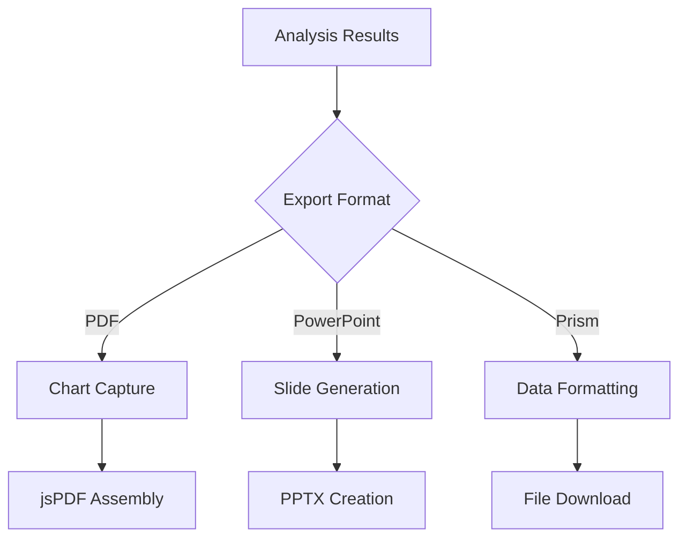

# Architecture Documentation

This document describes the technical architecture and design decisions for nVitro Studio.

## Overview

nVitro Studio is a client-side web application built with Next.js that performs dose-response analysis for biological assays. The application processes Excel files, fits four-parameter logistic curves, and generates comprehensive reports.

## Technology Stack

### Frontend Framework
- **Next.js 15**: React-based framework with App Router
- **React 19**: UI library with modern features
- **TypeScript**: Type safety and development experience

### UI & Visualization
- **Tailwind CSS**: Utility-first styling framework
- **Recharts**: Chart library for data visualization
- **Headless UI**: Accessible component primitives

### Data Processing
- **XLSX**: Excel file parsing and data extraction
- **Mathematical algorithms**: Custom curve fitting implementation

### Export Capabilities
- **jsPDF**: PDF generation with charts
- **html2canvas**: Chart image capture
- **Custom utilities**: PowerPoint and Prism format export

## Application Architecture

### High-Level Structure

```
┌─────────────────────────────────────────────────────────────────┐
│                         Client Browser                         │
├─────────────────────────────────────────────────────────────────┤
│  Next.js App Router (src/app/)                                 │
│  ├── layout.tsx     # Root layout                              │
│  └── page.tsx       # Main application page                    │
├─────────────────────────────────────────────────────────────────┤
│  React Components (src/components/)                            │
│  ├── FileUpload      # File processing                         │
│  ├── DataEditor      # Data manipulation                       │
│  ├── CurveFitter     # Analysis controls                       │
│  ├── ResultsDisplay  # Visualization                           │
│  └── Export Components # PDF, PowerPoint, Prism               │
├─────────────────────────────────────────────────────────────────┤
│  Core Logic                                                     │
│  ├── fitUtils.ts     # Curve fitting algorithms               │
│  ├── types.ts        # TypeScript definitions                 │
│  └── utils/          # Export and processing utilities        │
└─────────────────────────────────────────────────────────────────┘
```

## Core Data Flow

### 1. Data Import Pipeline

```mermaid
graph TD
    A[Excel File Upload] --> B[XLSX Parser]
    B --> C[Data Validation]
    C --> D[DataPoint[] Structure]
    D --> E[Column Configuration]
    E --> F[Replicate Grouping]
    F --> G[Dataset Creation]
```

### 2. Analysis Pipeline

```mermaid
graph TD
    A[Dataset(s)] --> B[Curve Fitting Engine]
    B --> C[Four-Parameter Logistic]
    C --> D[Parameter Optimization]
    D --> E[Statistical Calculations]
    E --> F[FittedCurve Objects]
    F --> G[Visualization Data]
```

### 3. Export Pipeline



## Component Architecture

### State Management Strategy

The application uses React's built-in state management with strategic state lifting:

```typescript
// Main Application State (page.tsx)
interface ApplicationState {
  // Core data
  data: DataPoint[];
  datasets: Dataset[];
  fittedCurves: FittedCurve[];
  
  // Multi-dataset management
  fittedCurvesByDataset: Record<string, FittedCurve[]>;
  curveColorsByDataset: Record<string, string[]>;
  curveVisibilityByDataset: Record<string, boolean[]>;
  
  // Original vs edited data tracking
  originalDataByDataset: Record<string, DataPoint[]>;
  editedDataByDataset: Record<string, DataPoint[]>;
  
  // UI state
  activeDatasetIndex: number;
  globalChartSettings: ChartSettings;
  workflowOptions: WorkflowOptions;
}
```

### Component Hierarchy

```
App (page.tsx)
├── FileUpload
│   ├── File processing logic
│   └── Multi-table detection
├── DataEditor
│   ├── Inline editing
│   ├── Dataset switching
│   └── Data validation
├── CurveFitter
│   ├── Fitting controls
│   └── Progress tracking
├── ResultsDisplay
│   ├── Chart rendering (Recharts)
│   ├── Statistical summaries
│   ├── Color/visibility controls
│   └── Dataset navigation
└── Export Components
    ├── PDFExport
    ├── PowerPointExport
    └── PrismExportModal
```

## Core Algorithms

### Four-Parameter Logistic Regression

The curve fitting engine implements the four-parameter logistic equation:

```typescript
Y = Bottom + (Top - Bottom) / (1 + (2^(1/HillSlope) - 1) * (EC50/X)^HillSlope)
```

**Parameters:**
- `Top`: Maximum response plateau
- `Bottom`: Minimum response plateau  
- `EC50`: Concentration producing 50% of maximum effect
- `HillSlope`: Steepness of the dose-response curve

**Optimization Method:**
- Grid search algorithm for parameter estimation
- R-squared goodness-of-fit calculation
- EC10/EC90 derivation from fitted parameters

### Data Processing Logic

#### Replicate Handling
```typescript
interface ReplicateProcessing {
  grouping: string[];           // Group assignments per column
  averaging: boolean;           // Calculate means and SEM
  errorBars: boolean;          // Display error bars in charts
}
```

#### Multi-Dataset Management
```typescript
interface DatasetManagement {
  merging: boolean;            // Combine datasets into single analysis
  individual: boolean;         // Keep datasets separate
  comparison: boolean;         // Enable cross-dataset comparisons
}
```

## File Processing Architecture

### Excel File Parsing

```typescript
interface FileProcessor {
  supportedFormats: ['.xls', '.xlsx'];
  sheetDetection: 'automatic' | 'manual';
  dataValidation: {
    concentrationColumn: number;    // Must be numeric
    responseColumns: number[];      // Must be numeric
    headerDetection: boolean;       // Auto-detect headers
  };
}
```

### Export System Architecture

#### PDF Export
- **Chart Capture**: html2canvas for chart images
- **Layout Engine**: jsPDF for document assembly
- **Content Structure**: Summary + Charts + Data tables

#### PowerPoint Export  
- **Slide Templates**: Predefined layouts
- **Chart Integration**: SVG/PNG chart embedding
- **Data Tables**: Formatted statistical summaries

#### Prism Export
- **Format Compatibility**: GraphPad Prism file structure
- **Data Organization**: Column-wise data with metadata

## Performance Considerations

### Memory Management
- Deep copying for data integrity
- Efficient state updates to prevent unnecessary re-renders
- Cleanup of large file processing operations

### Rendering Optimization
- React.memo for expensive chart components
- useMemo for computed values
- useCallback for stable function references

### Large Dataset Handling
- Chunked processing for large Excel files
- Progressive loading for complex visualizations
- Optimized chart rendering with data point limits

## Security & Data Handling

### Client-Side Processing
- All data processing occurs in browser
- No server-side data transmission
- Files processed locally only

### Data Validation
- Type checking for all inputs
- Range validation for concentrations and responses
- Error handling for malformed files

## Extensibility Points

### Adding New Chart Types
1. Extend `FittedCurve` interface if needed
2. Add chart component to `ResultsDisplay`
3. Update global chart settings
4. Implement export support

### Adding New Export Formats
1. Create utility module in `src/utils/`
2. Define export interface
3. Add UI controls
4. Implement error handling

### Adding New Curve Models
1. Implement fitting algorithm in `fitUtils.ts`
2. Update `FittedCurve` interface
3. Add model selection UI
4. Update export formats

## Error Handling Strategy

### File Processing Errors
- Format validation before processing
- Graceful degradation for corrupt files
- User-friendly error messages

### Calculation Errors
- Numerical stability checks
- Fallback algorithms for poor fits
- Clear indication of fitting quality

### Export Errors
- Browser compatibility checks
- File size limitations
- Network timeout handling

## Browser Compatibility

### Minimum Requirements
- Modern ES6+ support
- File API support
- Canvas API for chart capture
- Download API for exports

### Tested Browsers
- Chrome 90+
- Firefox 88+
- Safari 14+
- Edge 90+

## Development Patterns

### TypeScript Usage
- Strict type checking enabled
- Interface definitions for all data structures
- Generic types for reusable components
- Proper error type handling

### React Patterns
- Functional components with hooks
- Custom hooks for complex logic
- Error boundaries for resilience
- Prop drilling minimization

### Code Organization
- Feature-based file organization
- Separation of concerns
- Pure functions for algorithms
- Stateless utility functions